<h2>Tensorflow-Image-Segmentation-Clustered-Cervical-Cell (2024/12/14)</h2>

This is the first experiment of Image Segmentation for Clustered-Cervical-Cell 
 based on 
the latest <a href="https://github.com/sarah-antillia/Tensorflow-Image-Segmentation-API">Tensorflow-Image-Segmentation-API</a>, 
and  <a href="https://drive.google.com/file/d/1_vhxY7qIBhymMBQjNyjGjc9mDOSZyI5d/view?usp=sharing">
Clustered-Cervical-Cell-ImageMask-Dataset.zip</a>, which was derived by us from <b>clusteredCell</b> in 
<a href="https://www.kaggle.com/datasets/zhaojing0522/cervical-nucleus-segmentation">
<b>CNSeg: : A dataset for cervical nuclear segmentation</b>
</a>
  
Please see also our similaf experiment 
<a href="https://github.com/sarah-antillia/Tensorflow-Image-Segmentation-Augmented-Cervical-Nucleus">
Tensorflow-Image-Segmentation-Augmented-Cervical-Nucleus</a>
 
 

<b>Actual Image Segmentation for Images of 512x512 pixels</b> 
As shown below, the inferred masks look similar to the ground truth masks.  

<table>
<tr>
<th>Input: image</th>
<th>Mask (ground_truth)</th>
<th>Prediction: inferred_mask</th>
</tr>
<tr>
<td>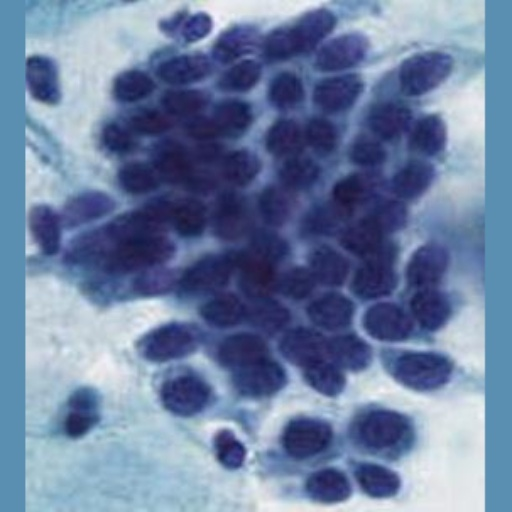</td>
<td>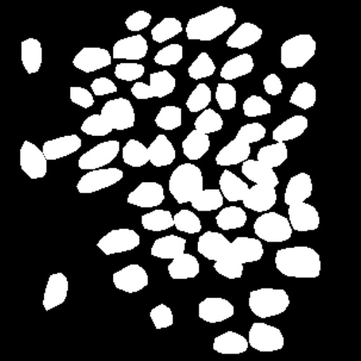</td>
<td></td>
</tr>

<tr>
<td>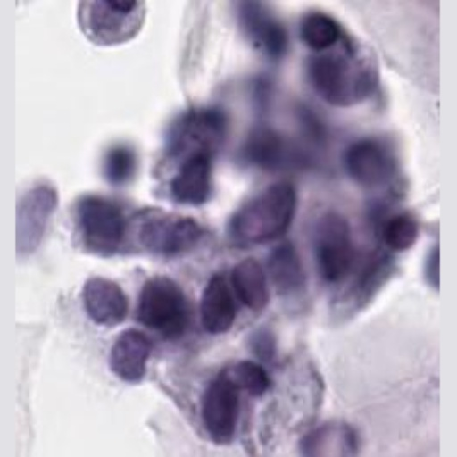</td>
<td>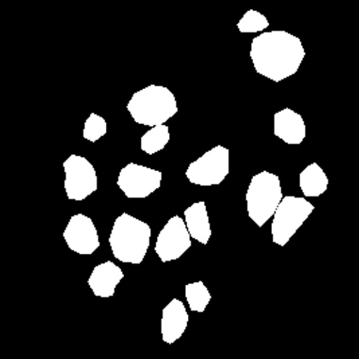</td>
<td>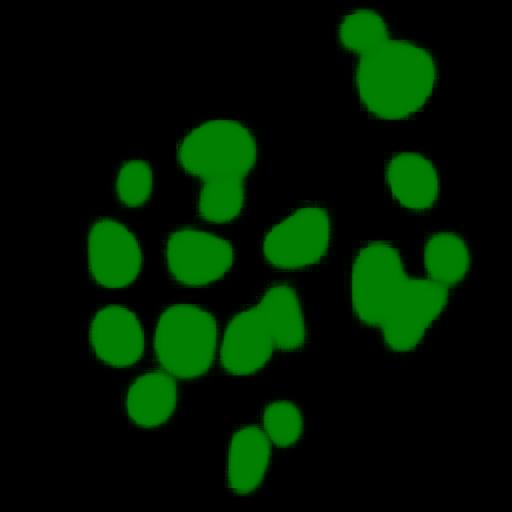</td>
</tr>

<tr>
<td>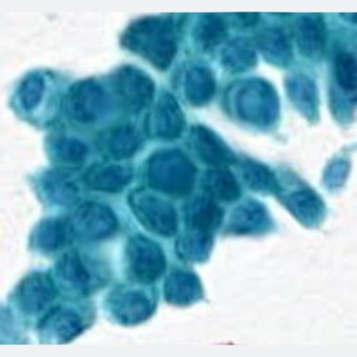</td>
<td></td>
<td>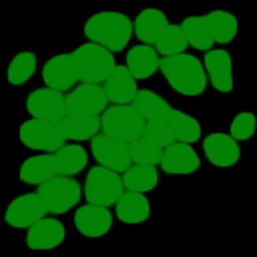</td>
</tr>
</table>

 
In this experiment, we used the simple UNet Model 
<a href="./src/TensorflowUNet.py">TensorflowSlightlyFlexibleUNet</a> for this Clustered-Cervical-CellSegmentation Model. 
As shown in <a href="https://github.com/sarah-antillia/Tensorflow-Image-Segmentation-API">Tensorflow-Image-Segmentation-API</a>.
you may try other Tensorflow UNet Models: 

<li><a href="./src/TensorflowSwinUNet.py">TensorflowSwinUNet.py</a></li>
<li><a href="./src/TensorflowMultiResUNet.py">TensorflowMultiResUNet.py</a></li>
<li><a href="./src/TensorflowAttentionUNet.py">TensorflowAttentionUNet.py</a></li>
<li><a href="./src/TensorflowEfficientUNet.py">TensorflowEfficientUNet.py</a></li>
<li><a href="./src/TensorflowUNet3Plus.py">TensorflowUNet3Plus.py</a></li>
<li><a href="./src/TensorflowDeepLabV3Plus.py">TensorflowDeepLabV3Plus.py</a></li>

 

<h3>1. Dataset Citation</h3>
The dataset used here from the kaggle web site: 
<a href="https://www.kaggle.com/datasets/zhaojing0522/cervical-nucleus-segmentation">
<b>CNSeg: : A dataset for cervical nuclear segmentation</b>
</a>
 
 
<b>Authors:</b> 
 Jing Zhao, Yong-jun He, Shu-Hang Zhou, Jian Qin, Yi-ning Xie 
 
@article{ZHAO2023107732, title = {CNSeg: A dataset for cervical nuclear segmentation},  
journal = {Computer Methods and Programs in Biomedicine}, volume = {241}, pages = {107732}, year = {2023}, issn = {0169-2607},  
doi = {https://doi.org/10.1016/j.cmpb.2023.107732},  
url = {https://www.sciencedirect.com/science/article/pii/S016926072300398X}, 
author = {Jing Zhao and Yong-jun He and Shu-Hang Zhou and Jian Qin and Yi-ning Xie} } 

 
Please see also:<a href="https://github.com/jingzhaohlj/AL-Net">https://github.com/jingzhaohlj/AL-Net</a> 

 
<b>License</b>: Unknown  
 

 
<h3>
<a id="2">
2 Clustered-Cervical-Cell ImageMask Dataset
</a>
</h3>
 If you would like to train this Clustered-Cervical-Cell Segmentation model by yourself,
 please download the dataset from the google drive  
<a href="https://drive.google.com/file/d/1_vhxY7qIBhymMBQjNyjGjc9mDOSZyI5d/view?usp=sharing">
Clustered-Cervical-Cell-ImageMask-Dataset.zip</a>
, expand the downloaded ImageMaskDataset and put it under <b>./dataset</b> folder to be
<pre>
./dataset
└─Clustered-Cervical-Cell
    ├─test
    │   ├─images
    │   └─masks
    ├─train
    │   ├─images
    │   └─masks
    └─valid
        ├─images
        └─masks
</pre>
 
This is a pre-augmented image and mask dataset derived from 
<b>clusteredCell/difficult</b> set in 
<a href="https://www.kaggle.com/datasets/zhaojing0522/cervical-nucleus-segmentation">
<b>CNSeg: : A dataset for cervical nuclear segmentation</b>
</a>
by the following Python scripts: 
<li>
<a href="./generator/Clustered-ImageMaskDatasetGenerator.py">Clustered-ImageMaskDatasetGenerator.py</a>
</li>
<li> 
<a href="./generator/split_master.py">split_master.py</a>
</li>
 
Please see also <a href="https://github.com/sarah-antillia/ImageMask-Dataset-Cervical-Nucleus">ImageMask-Dataset-Cervical-Nucleus
</a>
 
 
<b>Clustered-Cervical-Cell Statistics</b> 
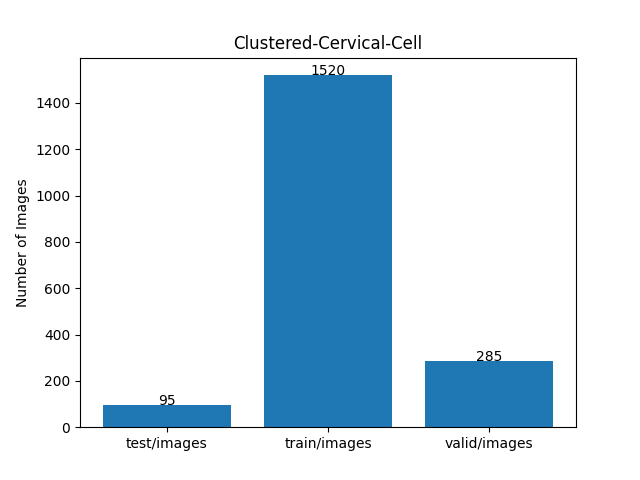 
 
As shown above, the number of images of train and valid datasets is not so large, but enough to use for a training set of our segmentation model.

 
 
<b>Train_images_sample</b> 
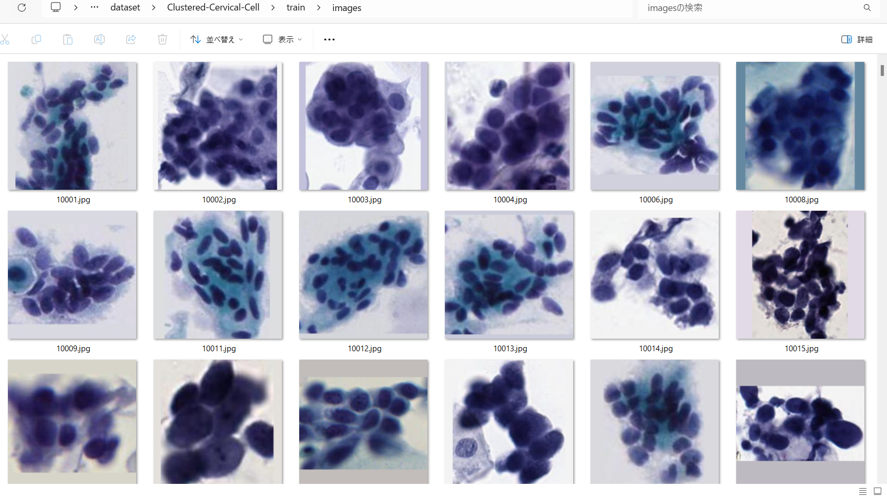
 
<b>Train_masks_sample</b> 
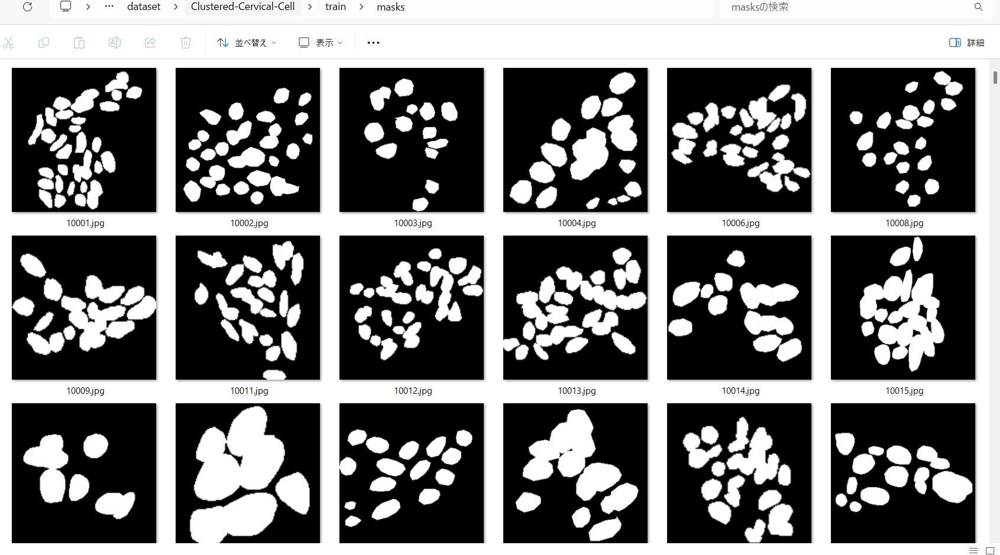
 

<h3>
3 Train TensorflowUNet Model
</h3>
 We have trained Clustered-Cervical-CellTensorflowUNet Model by using the following
<a href="./projects/TensorflowSlightlyFlexibleUNet/Clustered-Cervical-Cell/train_eval_infer.config"> <b>train_eval_infer.config</b></a> file.  
Please move to ./projects/TensorflowSlightlyFlexibleUNet/Clustered-Cervical-Celland run the following bat file. 
<pre>
>1.train.bat
</pre>
, which simply runs the following command. 
<pre>
>python ../../../src/TensorflowUNetTrainer.py ./train_eval_infer.config
</pre>

<b>Model parameters</b> 
Defined a small <b>base_filters</b> and large <b>base_kernels</b> for the first Conv Layer of Encoder Block of 
<a href="./src/TensorflowUNet.py">TensorflowUNet.py</a> 
and a large num_layers (including a bridge between Encoder and Decoder Blocks).
<pre>
[model]
base_filters   = 16
base_kernels   = (9,9)
num_layers     = 8
dilation       = (3,3)
</pre>

<b>Learning rate</b> 
Defined a small learning rate.  
<pre>
[model]
learning_rate  = 0.00007
</pre>

<b>Online augmentation</b> 
Disabled our online augmentation tool. 
<pre>
[model]
model         = "TensorflowUNet"
generator     = False
</pre>

<b>Loss and metrics functions</b> 
Specified "bce_dice_loss" and "dice_coef". 
<pre>
[model]
loss           = "bce_dice_loss"
metrics        = ["dice_coef"]
</pre>
<b >Learning rate reducer callback</b> 
Enabled learing_rate_reducer callback, and a small reducer_patience.
<pre> 
[train]
learning_rate_reducer = True
reducer_factor     = 0.3
reducer_patience   = 4
</pre>

<b>Early stopping callback</b> 
Enabled early stopping callback with patience parameter.
<pre>
[train]
patience      = 10
</pre>

<b>Epoch change inference callbacks</b> 
Enabled epoch_change_infer callback. 
<pre>
[train]
epoch_change_infer       = True
epoch_change_infer_dir   =  "./epoch_change_infer"
epoch_changeinfer        = False
epoch_changeinfer_dir    = "./epoch_changeinfer"
num_infer_images         = 6
</pre>

By using this callback, on every epoch_change, the inference procedure can be called
 for 6 images in <b>mini_test</b> folder. This will help you confirm how the predicted mask changes 
 at each epoch during your training process.    

<b>Epoch_change_inference output</b> 
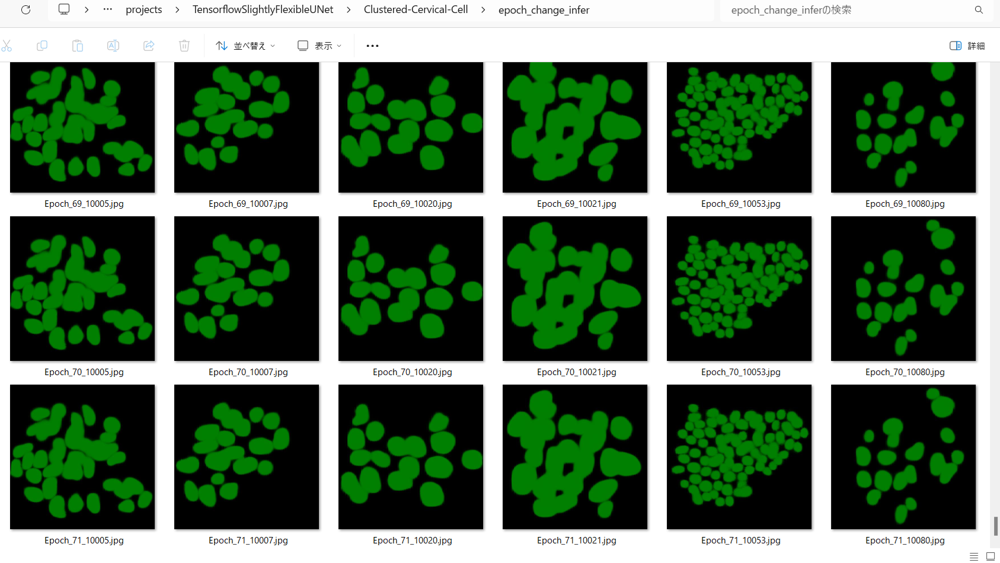 
 
On detail, please refer to <a href="./projects/TensorflowSlightlyFlexibleUNet/Clustered-Cervical-Cell/epoch_change_infer">
epoch_change_infer</a> folder.
 
 
In this experiment, the training process was stopped at epoch 54  by EarlyStopping Callback.  
 
 

<a href="./projects/TensorflowSlightlyFlexibleUNet/Clustered-Cervical-Cell/eval/train_metrics.csv">train_metrics.csv</a> 
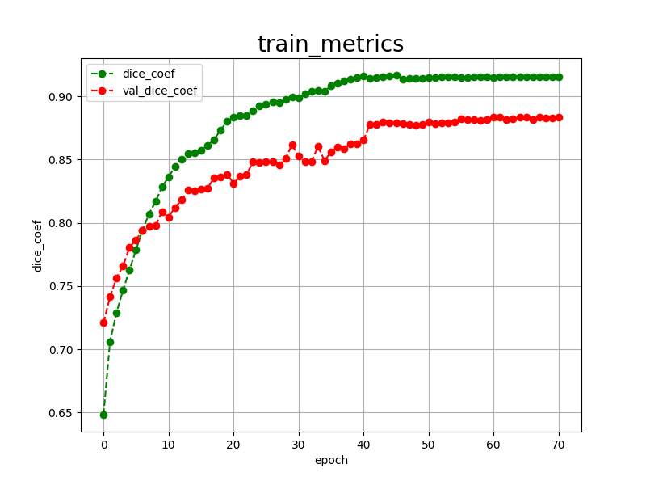 

 
<a href="./projects/TensorflowSlightlyFlexibleUNet/Clustered-Cervical-Cell/eval/train_losses.csv">train_losses.csv</a> 
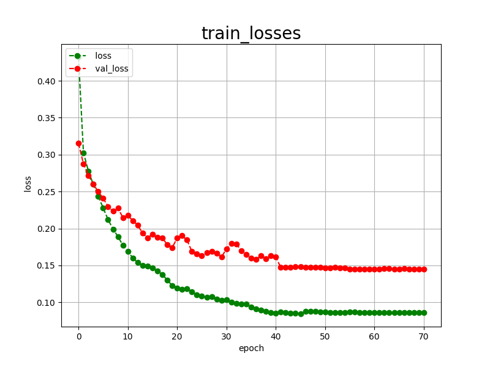 

 

<h3>
4 Evaluation
</h3>
Please move to a <b>./projects/TensorflowSlightlyFlexibleUNet/Clustered-Cervical-Cell</b> folder, 
and run the following bat file to evaluate TensorflowUNet model for Clustered-Cervical-Cell. 
<pre>
./2.evaluate.bat
</pre>
This bat file simply runs the following command.
<pre>
python ../../../src/TensorflowUNetEvaluator.py ./train_eval_infer_aug.config
</pre>

Evaluation console output: 

  Image-Segmentation-Clustered-Cervical-Cell

<a href="./projects/TensorflowSlightlyFlexibleUNet/Clustered-Cervical-Cell/evaluation.csv">evaluation.csv</a> 

The loss (bce_dice_loss) to this Clustered-Cervical-Cell/test was low, but dice_coef not so high as shown below.
 
<pre>
loss,0.1651
dice_coef,0.8646
</pre>
 

<h3>
5 Inference
</h3>
Please move to a <b>./projects/TensorflowSlightlyFlexibleUNet/Clustered-Cervical-Cell</b> folder 
,and run the following bat file to infer segmentation regions for images by the Trained-TensorflowUNet model for Clustered-Cervical-Cell. 
<pre>
./3.infer.bat
</pre>
This simply runs the following command.
<pre>
python ../../../src/TensorflowUNetInferencer.py ./train_eval_infer_aug.config
</pre>

<b>mini_test_images</b> 
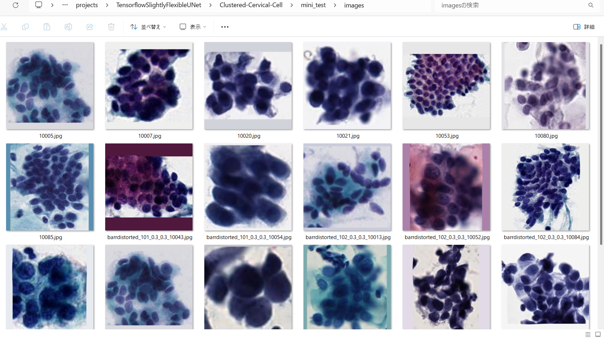 
<b>mini_test_mask(ground_truth)</b> 
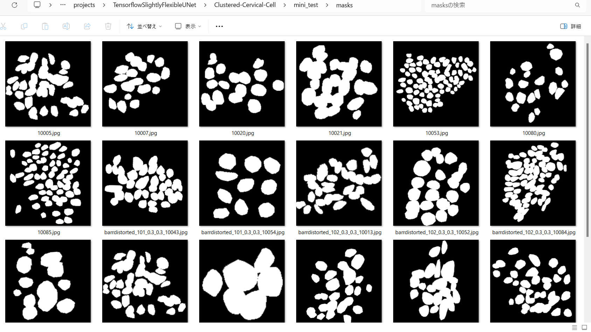 

<b>Inferred test masks</b> 
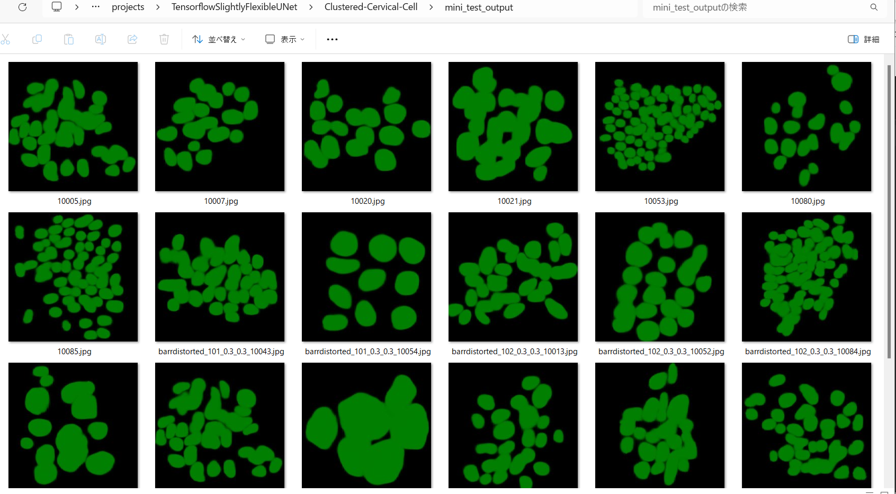 
 

<b>Enlarged images and masks </b> 

<table>
<tr>
<th>Image</th>
<th>Mask (ground_truth)</th>
<th>Inferred-mask</th>
</tr>

<tr>
<td>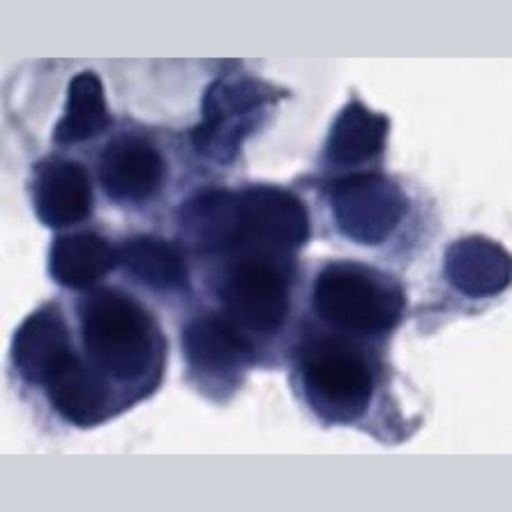</td>
<td>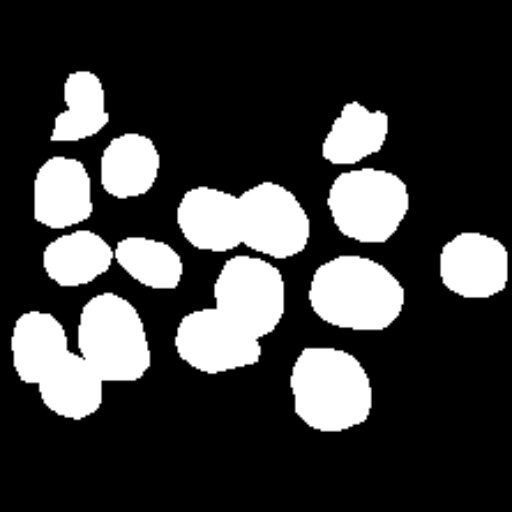</td>
<td>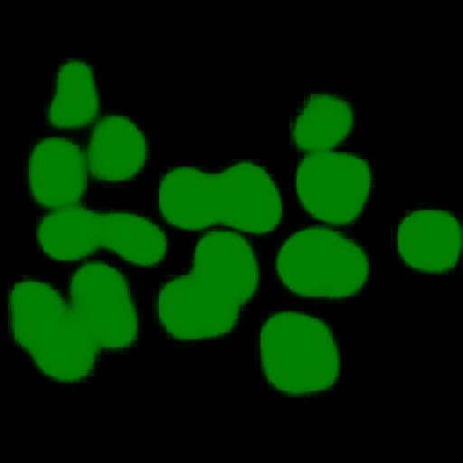</td>
</tr>

<tr>
<td></td>
<td></td>
<td></td>
</tr>

<tr>
<td></td>
<td></td>
<td></td>
</tr>
<tr>
<td>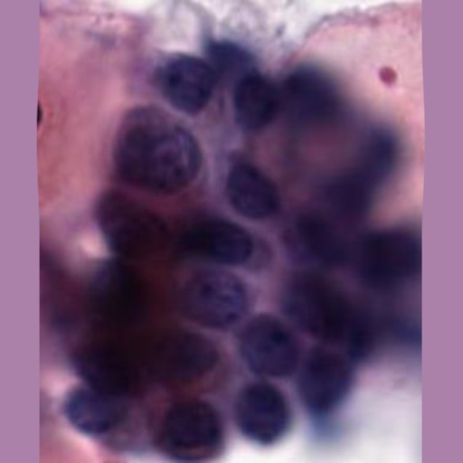</td>
<td>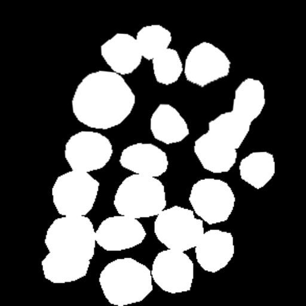</td>
<td>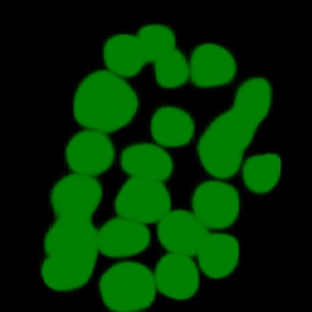</td>
</tr>
<tr>
<td>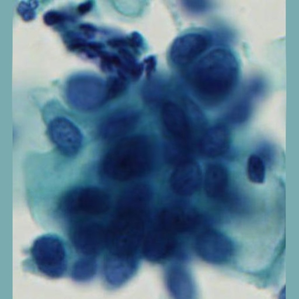</td>
<td>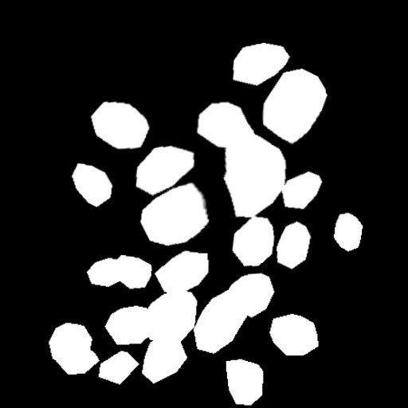</td>
<td>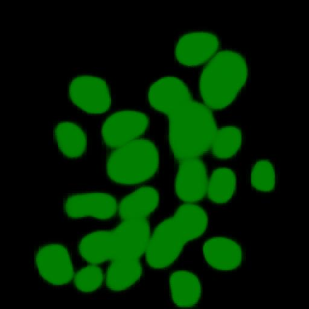</td>
</tr>
<tr>
<td>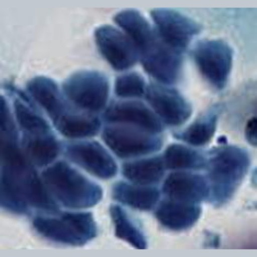</td>
<td>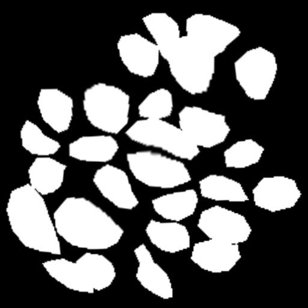</td>
<td>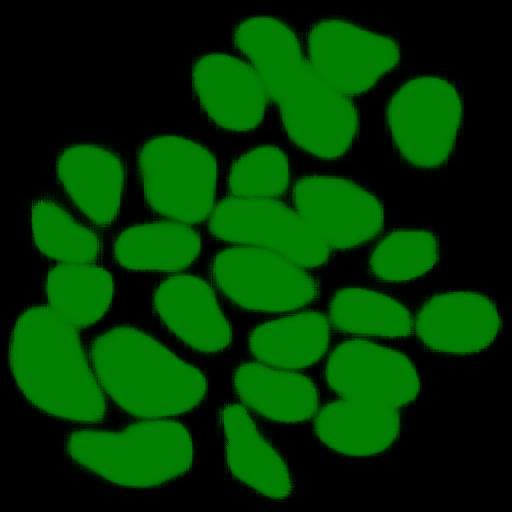</td>
</tr>
</table>

 

<h3>
References
</h3>
<b>1. CNSeg: : A dataset for cervical nuclear segmentation</b> 

<a href="https://dl.acm.org/doi/abs/10.1016/j.cmpb.2023.107732">
https://dl.acm.org/doi/abs/10.1016/j.cmpb.2023.107732
</a>
 
@article{ZHAO2023107732, title = {CNSeg: A dataset for cervical nuclear segmentation},  
journal = {Computer Methods and Programs in Biomedicine}, volume = {241}, pages = {107732}, year = {2023}, issn = {0169-2607},  
doi = {https://doi.org/10.1016/j.cmpb.2023.107732},  
url = {https://www.sciencedirect.com/science/article/pii/S016926072300398X}, 
author = {Jing Zhao and Yong-jun He and Shu-Hang Zhou and Jian Qin and Yi-ning Xie} }
 
 
<b>2. ImageMask-Dataset-Cervical-Nucleus</b> 
Toshiyuki Arai @antillia.com 
<a href="https://github.com/sarah-antillia/ImageMask-Dataset-Cervical-Nucleus">
https://github.com/sarah-antillia/ImageMask-Dataset-Cervical-Nucleus</a>

  
<b>3. Tensorflow-Tiled-Image-Segmentation-Augmented-Cervical-Cancer </b> 
Toshiyuki Arai @antillia.com 
<a href="https://github.com/sarah-antillia/Tensorflow-Tiled-Image-Segmentation-Augmented-Cervical-Cancer">
https://github.com/sarah-antillia/Tensorflow-Tiled-Image-Segmentation-Augmented-Cervical-Cancer
</a>

